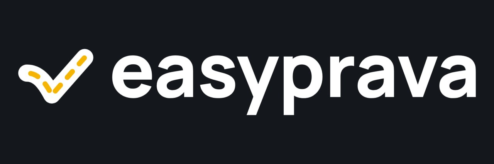
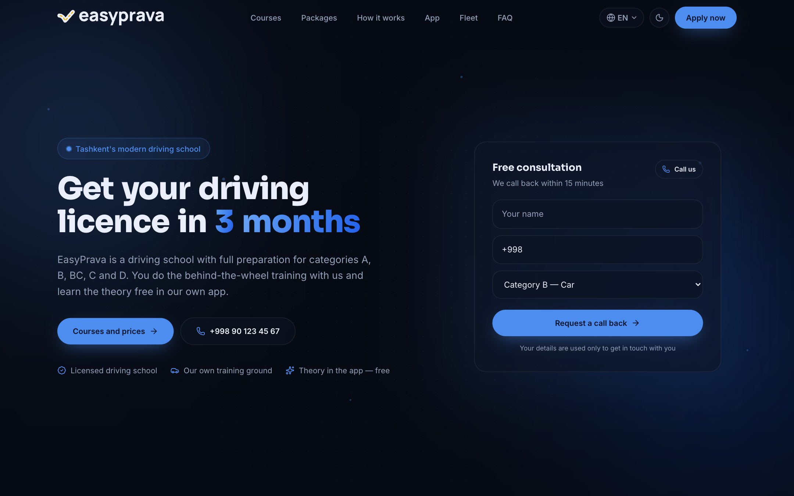
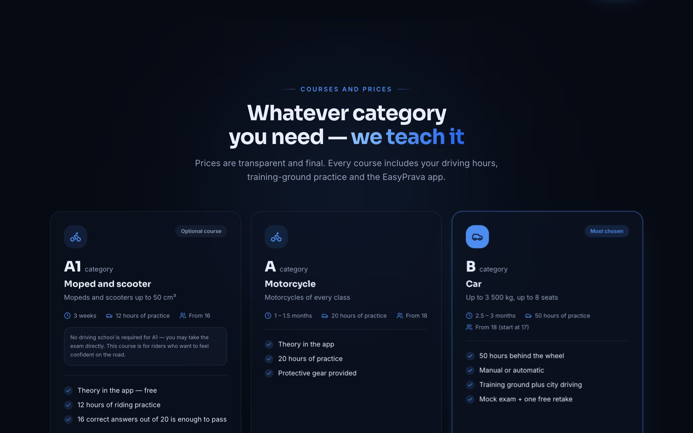
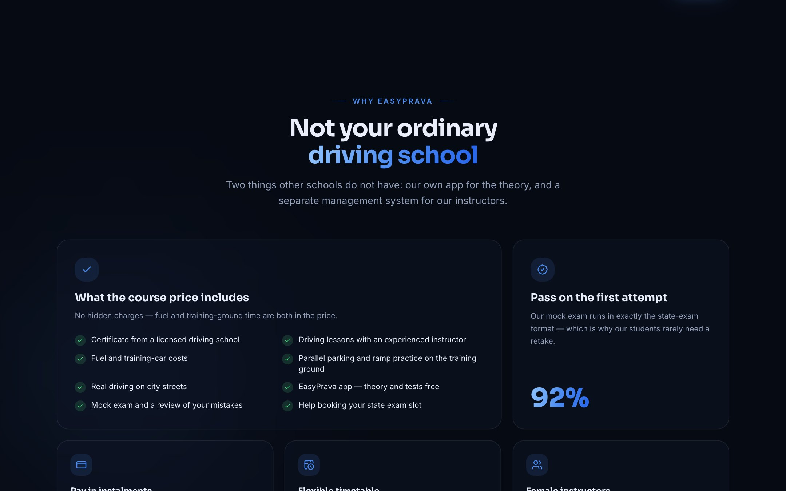
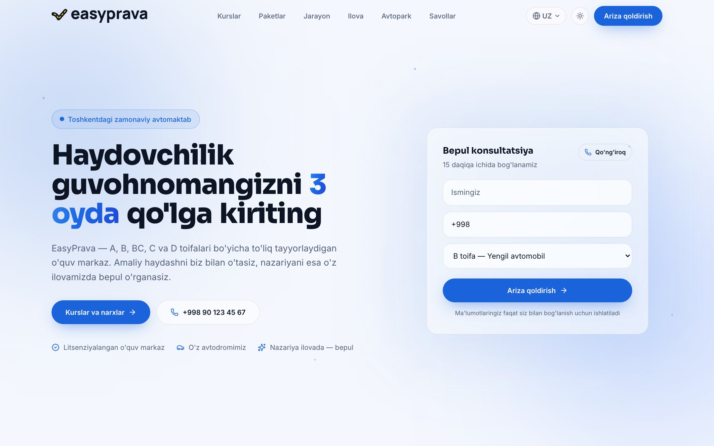
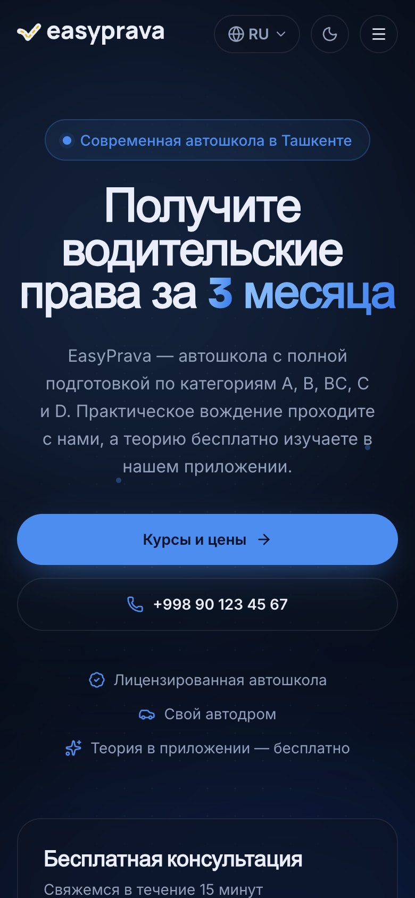

<p align="center">
  
</p>

<h3 align="center">A driving school built for Uzbekistan's post-reform market</h3>

<p align="center">
  Practical training in our own fleet and training ground &middot; theory in our own mobile app &middot; one platform for students and instructors
</p>

<p align="center">
  <a href="https://easyprava.uz"></a>
  
  
  
  
</p>

---

## The opportunity

On **1 February 2026** Uzbekistan changed how a driving licence is earned. For categories **A** and **B**, attending theory classes at a driving school is no longer mandatory — candidates may study the rules on their own and go straight to the state exam. What remains mandatory is **practical training at a licensed school**, recorded on an electronic certificate.

Every driving school in the country now has to answer the same question: *if students no longer need us for theory, what are we for?*

EasyPrava is our answer. We split the licence journey exactly the way the law now does:

| Stage | Where it happens | What we provide |
| --- | --- | --- |
| Theory (20 rules topics, 400 exam questions) | Anywhere, on the student's phone | **EasyPrava app** — free for every enrolled student |
| Practical training (behind the wheel, training ground, city driving) | Our school | Licensed instructors, dual-control fleet, our own training ground |
| Exam readiness | Our school + app | Mock exams in the exact state format; the student's app progress is visible to their instructor |

No other school in the market pairs a licensed training centre with its own software. That is the product.

## The ecosystem

This repository is the public web platform. It sits alongside two mobile applications that make up the full product:

| Product | Audience | Role |
| --- | --- | --- |
| **easyprava.uz** *(this repo)* | Prospective students | Courses, transparent pricing, enrolment, everything a student needs to decide |
| **EasyPrava** app (iOS / Android) | Enrolled students | The 20-topic theory course, 20 exam tickets in the official 20-question / 25-minute format, mistake review, personal statistics |
| **EasyPrava Instruktor** app (iOS / Android) | Our instructors | Student roster with progress, weekly schedule, lesson completion feeding the electronic certificate |

The mobile applications are built with React Native and live in their own repositories.

## What the site does

- **Sells every licence category** — A1, A, B, BC, C and D — with open, final prices, hours of practice and age requirements on each card, plus a plain statement of the state fees that are *not* ours, so no one is surprised later.
- **Three formats for the flagship B category** — group, intensive and one-to-one — with instalment maths shown inline.
- **Captures leads** through a two-field form in the hero and a fuller form in the enrolment section, delivered to Telegram in real time (see [Lead pipeline](#lead-pipeline)).
- **Explains the whole journey** in six steps, from application to a licence valid for ten years, including the 2026 rules and exam format.
- **Engages** with a three-question mock exam drawn from real state-exam material.
- **Speaks the market's languages** — English, Uzbek and Russian, each a fully translated, statically generated page with its own SEO metadata.
- **Looks the part** — a dark-first design with a light theme, scroll-driven reveals, cursor-tracking cards and a brand system traced from the official logo.

## Screenshots

<p align="center">
  
</p>

<table>
  <tr>
    <td width="50%"></td>
    <td width="50%"></td>
  </tr>
  <tr>
    <td width="50%"></td>
    <td width="50%" align="center"></td>
  </tr>
</table>

## Technology

| Layer | Choice | Why |
| --- | --- | --- |
| Framework | **Next.js 16** (App Router, static generation) | Every locale prerenders to static HTML; the only server code is the lead endpoint |
| Language | **TypeScript** | The translation contract is a type — a missing string is a build error, not a bug in production |
| Styling | **Tailwind CSS 4** + a small design-token layer | CSS-first configuration, one palette expressed as tokens for both themes |
| UI primitives | **shadcn/ui** (radix-luma), **lucide** icons | Accessible foundations without a heavy component library |
| Fonts | Inter, Sora | Self-hosted through `next/font`, Latin and Cyrillic subsets |
| Delivery | **Telegram Bot API** | Leads reach the sales phone within seconds, no CRM required on day one |

## Architecture

### Localisation as a contract

All copy lives in three dictionaries — `en`, `uz`, `ru` — and every one of them must satisfy a single TypeScript type:

```ts
// lib/i18n/types.ts
export type Dictionary = {
  hero: { badge: string; headline: string[]; headlineAccent: number[]; lead: string; /* … */ };
  courses: { items: Record<CourseCode, { title: string; perks: string[]; /* … */ }>; /* … */ };
  // … every section of the page
};
```

If a translator forgets a key, `next build` fails. Strings that vary in word order between languages use placeholders (`"Question {current} of {total}"`) rather than concatenation, so Uzbek, English and Russian each read naturally.

Routing follows the App Router convention — `app/[lang]/` — with all three locales generated at build time. A lightweight `proxy.ts` sends locale-less URLs to the visitor's preferred language (from `Accept-Language`) and falls back to English. Each locale page carries its own `<title>`, description, canonical URL, `hreflang` alternates and Open Graph locale.

### Content model

Anything that does not translate — prices, hours of practice, fleet counts, contact details, category codes — lives once in `lib/content.ts` and is joined to the dictionaries by `code` or `id`. Changing a price is a one-line edit in one file.

### Lead pipeline

```
Form (client) ──POST /api/lead──▶ Route handler ──▶ Telegram Bot API ──▶ Sales chat
                                       │
                                       └─▶ server log (fallback when no bot is configured)
```

Validation happens on both sides; the handler never returns success unless the message was actually delivered.

### Design system

Tokens (`--primary`, `--brand-yellow`, radii, surfaces) are defined once in `app/globals.css` and mirrored for the dark theme. Motion is opt-in — every animation respects `prefers-reduced-motion`, and content renders fully without JavaScript. The brand mark is inline SVG traced from the official logo, so it inverts with the theme and doubles as the favicon, Apple touch icon and Open Graph image.

## Project structure

```
app/
  [lang]/            layout, page and dictionary loader — one static page per locale
  api/lead/          Telegram lead handler
  icon.svg · icon.png · apple-icon.png · opengraph-image.png
components/
  landing/           one file per section (hero, courses, packages, process, …)
  logo.tsx           brand lockup as inline SVG
lib/
  content.ts         locale-invariant data: prices, hours, contacts, ids
  i18n/
    config.ts        locales, default, BCP-47 tags
    types.ts         the Dictionary contract
    dictionaries/    en.ts · uz.ts · ru.ts
proxy.ts             locale redirect
docs/screenshots/
```

## Getting started

Requirements: Node.js 20.9 or newer.

```bash
npm install
npm run dev        # http://localhost:3000 → redirects to /en, /uz or /ru
```

```bash
npm run lint
npm run build      # prerenders /en, /uz and /ru
npm run start
```

### Configuration

Lead delivery needs a Telegram bot. Create one with [@BotFather](https://t.me/BotFather), add the bot to the chat that should receive applications, and set:

```bash
# .env.local  (and the same variables on your hosting provider)
TELEGRAM_BOT_TOKEN=123456:ABC-DEF…
TELEGRAM_CHAT_ID=-1001234567890
```

Without them the endpoint still accepts submissions and writes them to the server log, so nothing is lost during setup.

### Editing content

| To change… | Edit |
| --- | --- |
| Prices, practice hours, fleet, instructors, contacts | `lib/content.ts` |
| Any text in one language | `lib/i18n/dictionaries/<locale>.ts` |
| The default language | `DEFAULT_LOCALE` in `lib/i18n/config.ts` |

### Adding a language

1. Add the code to `LOCALES` and its names/tags in `lib/i18n/config.ts`.
2. Create `lib/i18n/dictionaries/<code>.ts` exporting a `Dictionary` — the compiler lists every key you still owe.
3. Register the loader in `app/[lang]/dictionaries.ts`.

The switcher, routing, static generation and `hreflang` tags pick the new locale up automatically.

## Roadmap

- Online enrolment with card and instalment payment (Payme, Click)
- Student cabinet on the web: schedule, progress and certificate status
- Instructor availability synced from the Instruktor app into the enrolment form
- Public launch of the mobile applications on the App Store and Google Play
- Additional branches beyond Tashkent

## Team

EasyPrava is built and operated by **StackNova**, a product studio in Tashkent.

Maintainer: **Diyorbek Erkinov** &middot; [@easyprava_uz](https://t.me/easyprava_uz) &middot; info@easyprava.uz

## License

Proprietary. &copy; 2026 EasyPrava. All rights reserved.
